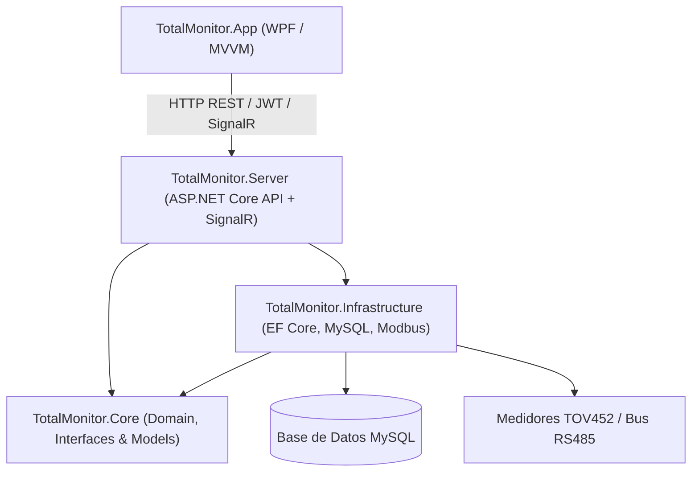

# Total Monitor ⚡

> **Desarrollado por el Ing. Roman Velasco Moctezuma**

Sistema profesional de monitoreo y análisis de calidad de energía para medidores **Total Ground TOV452**. Diseñado bajo una arquitectura desacoplada cliente-servidor, con adquisición de datos en tiempo real sobre bus industrial Modbus RTU (RS-485), persistencia histórica de alto rendimiento y una interfaz de escritorio intuitiva construida en WPF.


---

## 📋 Tabla de Contenido

- [Características Principales](#-características-principales)
- [Arquitectura del Sistema](#-arquitectura-del-sistema)
- [Tecnologías y Stack](#-tecnologías-y-stack)
- [Estructura del Proyecto](#-estructura-del-proyecto)
- [Requisitos Previos](#-requisitos-previos)
- [Puesta en Marcha (Desarrollo)](#-puesta-en-marcha-desarrollo)
  - [1. Configuración de Base de Datos](#1-configuración-de-base-de-datos)
  - [2. Configuración de Seguridad y Servidor](#2-configuración-de-seguridad-y-servidor)
  - [3. Compilación y Ejecución](#3-compilación-y-ejecución)
- [Módulos Clave](#-módulos-clave)
  - [Motor de Adquisición Modbus](#motor-de-adquisición-modbus-rs-485)
  - [Seguridad y Control de Acceso](#seguridad-y-control-de-acceso-rbac)
  - [Históricos y Reportes](#análisis-histórico-y-reportes)
- [Instalación y Despliegue en Producción](#-instalación-y-despliegue-en-producción)
- [Documentación Adicional](#-documentación-adicional)

---

## 🚀 Características Principales

- **Monitoreo en Tiempo Real**: Visualización en vivo del estado de los medidores, variables eléctricas (voltaje, corriente, potencia, factor de potencia, armónicos) mediante WebSockets / SignalR.
- **Comunicación Industrial Modbus RTU / RS-485**: Motor de adquisición asíncrono con control de concurrencia por semáforos, gestión de colisiones, reintentos inteligentes y cálculo de CRC16.
- **Modo Simulación / Mock**: Transporte simulado integrado para pruebas y validaciones sin necesidad de hardware físico conectado.
- **Arquitectura Cliente-Servidor**: Servidor centralizado (ASP.NET Core Web API + SignalR) desacoplado del cliente de escritorio (WPF MVVM).
- **Seguridad Robusta (RBAC)**: Autenticación mediante tokens JWT, hashing de contraseñas con PBKDF2-SHA512 con salt aleatorio y permisos granulares por rol (`Administrator`, `Technician`, `Viewer`).
- **Análisis Histórico y Exportación**: Filtrado multidimensional, agregación estadística en base de datos (mínimos, máximos, promedios) y exportación de reportes a formato CSV estándar RFC 4180.
- **Auditoría Integral**: Registro de eventos del sistema (inicios de sesión, cambios de configuración, altas/bajas de usuarios y exportaciones) garantizando trazabilidad y cumplimiento.
- **Instalador Integrado**: Script de empaquetado para Inno Setup con soporte de ejecución como Servicio de Windows (*Windows Service*).

---

## 🏛️ Arquitectura del Sistema

El proyecto sigue los principios de **Clean Architecture**, asegurando que el dominio central permanezca completamente desacoplado de frameworks e infraestructura externa:



---

## 🛠️ Tecnologías y Stack

| Componente | Tecnología |
| :--- | :--- |
| **Plataforma** | .NET 8 (C# 12) |
| **Backend / API** | ASP.NET Core Web API, SignalR, Hosted Background Services |
| **Frontend de Escritorio** | WPF (Windows Presentation Foundation) con patrón MVVM y CommunityToolkit |
| **Persistencia / ORM** | Entity Framework Core 8 con Pomelo MySQL Provider |
| **Base de Datos** | MySQL 8.0+ / MariaDB |
| **Comunicación Serial** | `System.IO.Ports`, Modbus RTU (CRC16, Function Codes 03/04) |
| **Seguridad** | JWT Bearer, PBKDF2-SHA512, Claims-based Authorization |
| **Empaquetado** | Inno Setup, scripts PowerShell |

---

## 📁 Estructura del Proyecto

```text
├── docs/                               # Documentación técnica y manuales
│   ├── architecture.md                 # Detalles de arquitectura
│   ├── installation.md                 # Guía paso a paso de instalación
│   ├── tov452-modbus.md                # Especificación del protocolo TOV452
│   ├── troubleshooting.md             # Solución de problemas comunes
│   └── user-manual.md                  # Manual de usuario
├── installer/                          # Archivos fuente y assets de Inno Setup
│   ├── assets/                         # Gráficos del asistente
│   └── TotalMonitor.iss                # Script de compilación del instalador
├── scripts/                            # Automatización en PowerShell
│   ├── publish.ps1                     # Script para compilar y empaquetar
│   ├── install-service.ps1             # Registro como servicio de Windows
│   ├── database-migrate.ps1            # Ejecución de migraciones EF Core
│   └── start-local.ps1                 # Inicio rápido local
├── src/
│   ├── TotalMonitor.Core/              # Entidades, contratos, lógica de negocio y Modbus Map
│   ├── TotalMonitor.Infrastructure/    # Implementación de repositorios, EF Core y transporte Serial
│   ├── TotalMonitor.Server/            # Web API, Hubs SignalR y Servicio en segundo plano
│   └── TotalMonitor.App/               # Interfaz gráfica de usuario WPF
└── tests/
    └── TotalMonitor.Core.Tests/        # Pruebas unitarias y de integración del pipeline
```

---

## ⚙️ Requisitos Previos

- **Sistema Operativo**: Windows 10 / Windows 11 o Windows Server 2019+
- **SDK**: [.NET 8.0 SDK](https://dotnet.microsoft.com/download/dotnet/8.0)
- **Base de Datos**: [MySQL Server 8.0+](https://dev.mysql.com/downloads/mysql/)
- **Opcional (para generar instaladores)**: [Inno Setup 6+](https://jrsoftware.org/isdl.php)

---

## 💻 Puesta en Marcha (Desarrollo)

### 1. Configuración de Base de Datos

1. Crea la base de datos en tu servidor MySQL:
   ```sql
   CREATE DATABASE totalmonitor CHARACTER SET utf8mb4 COLLATE utf8mb4_unicode_ci;
   ```
2. Configura la cadena de conexión en `src/TotalMonitor.Server/appsettings.Development.json` (o usando variables de entorno):
   ```json
   "ConnectionStrings": {
     "DefaultConnection": "Server=localhost;Port=3306;Database=totalmonitor;User=root;Password=tu_password;"
   }
   ```

### 2. Configuración de Seguridad y Servidor

En `appsettings.Development.json` configura los valores iniciales para desarrollo:
- `Authentication:SecretKey`: Clave secreta para firma de tokens JWT (mínimo 32 caracteres).
- `Authentication:InitialAdminUsername`: Nombre de usuario del administrador inicial.
- `Authentication:InitialAdminPassword`: Contraseña del administrador inicial.

> Al arrancar el servidor por primera vez, el sistema ejecutará automáticamente las migraciones y sembrará los roles, permisos y el usuario administrador inicial.

### 3. Compilación y Ejecución

Restaura las dependencias y compila toda la solución:

```powershell
# Restaurar y compilar la solución
dotnet restore TotalMonitor.sln
dotnet build TotalMonitor.sln

# Ejecutar las pruebas unitarias
dotnet test tests/TotalMonitor.Core.Tests

# Iniciar el Servidor (API en puerto 5080)
dotnet run --project src/TotalMonitor.Server --urls http://localhost:5080

# En otra terminal, iniciar la aplicación de escritorio
dotnet run --project src/TotalMonitor.App
```

---

## 🔌 Módulos Clave

### Motor de Adquisición Modbus (RS-485)
El servicio `DataAcquisitionService` coordina la lectura de variables eléctricas en medidores físicos y virtuales:
- Implementa polling secuencial y no bloqueante.
- Garantiza acceso exclusivo al bus serial mediante semáforos por puerto COM.
- Permite conmutar transparentemente entre hardware real y el simulador de pruebas (`MockModbusTransport`).

### Seguridad y Control de Acceso (RBAC)
- Sistema de autorización basado en políticas y permisos finos (`Dashboard.View`, `Monitoring.View`, `Meters.*`, `Reports.*`, `Users.*`, `Settings.*`).
- Las contraseñas se almacenan procesadas con **PBKDF2-SHA512** (100,000 iteraciones + salt aleatorio de 32 bytes).
- Historial de acciones en bitácora (`AuditLogs`) para auditorías de seguridad.

### Análisis Histórico y Reportes
- Consultas optimizadas con índices compuestos en base de datos (`MeterId + Timestamp`).
- Generación de métricas estadísticas (mínimo, máximo, promedio, delta) agrupadas por periodos.
- Exportación directa a CSV con cabeceras formateadas y escape seguro de campos.

---

## 📦 Instalación y Despliegue en Producción

Para generar los paquetes de distribución listos para producción:

```powershell
# Compilar y publicar cliente y servidor en modo self-contained (win-x64)
.\scripts\publish.ps1 -Target all

# Compilar instalador completo mediante Inno Setup
.\scripts\build-installer.ps1
```

El servidor puede instalarse como servicio de Windows en segundo plano:
```powershell
.\scripts\install-service.ps1 -InstallPath "C:\TotalMonitor\Server" -Port 5080
```

Para una guía exhaustiva de despliegue, consulta [docs/installation.md](docs/installation.md).

---

## 📖 Documentación Adicional

- 📐 [Arquitectura Técnica](docs/architecture.md)
- 🔌 [Integración y Registros Modbus TOV452](docs/tov452-modbus.md)
- 🚀 [Guía de Instalación y Despliegue](docs/installation.md)
- 🛡️ [Checklist de Producción](docs/production-checklist.md)
- 🔧 [Solución de Problemas (Troubleshooting)](docs/troubleshooting.md)
- 👤 [Manual de Usuario](docs/user-manual.md)

---

## 👤 Autor

**Ing. Roman Velasco Moctezuma**  
- **GitHub**: [@roman00120](https://github.com/roman00120)
- **Perfil**: Desarrollador / Ingeniero de Software Industrial


---

## 📄 Licencia

Este proyecto está protegido bajo derechos de autor y reservado para fines de monitoreo y calidad de energía.
